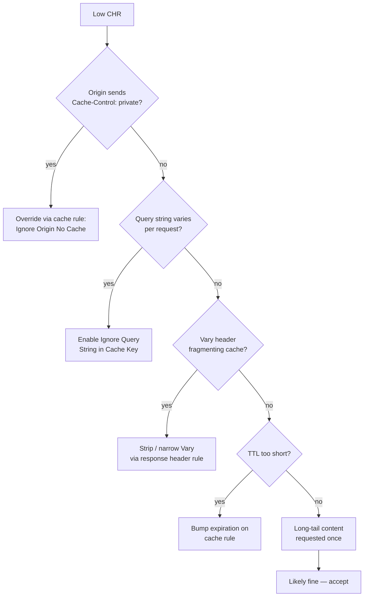

Cache hit ratio (CHR) is the single most important CDN metric. It's the share of requests served straight from the edge cache, with no origin round-trip. High CHR means lower latency, lower origin load, and a smaller bill.

<Frame caption="Cache Hit Ratio">
    
</Frame>

## How it's calculated

```
cache_hit_ratio = cache_hits / (cache_hits + cache_misses)
```

A `MISS` becomes a `HIT` after the first request fills the cache. A path that's only ever requested once is always a `MISS` and drags CHR down — that's normal for long-tail content.

## What "good" looks like

| Workload | Healthy CHR | Investigate |
|----------|-------------|-------------|
| Static assets (`/static/*`) | 95–99% | < 90% |
| Image library | 90–98% | < 85% |
| HLS / DASH VOD | 90–97% | < 85% |
| Mixed (HTML + API + assets) | 75–90% | < 65% |
| API-heavy (short TTL) | 30–70% | wildly variable |

Don't chase a single number — chase trend stability per path class.

## Read the chart

| Element | Meaning |
|---------|---------|
| Main % | Hit ratio over the window. |
| Trend line | Rolling CHR — sudden drops point at deploys, purges, or noisy keys. |
| Comparison % | Change vs prior period. |

## Pull via API

```bash
curl -sS "https://api.tenbyte.io/cdn/distributions/$DISTRIBUTION_ID/analytics/cache?from=2026-05-01T00:00:00Z&to=2026-05-09T00:00:00Z" \
  -H "Authorization: Bearer $TENBYTE_API_TOKEN" | jq
```

```json
{
  "hits": 41510234,
  "misses": 3501112,
  "hit_ratio": 0.922,
  "series": [
    {"ts": "2026-05-01T00:00:00Z", "hit_ratio": 0.94}
  ]
}
```

## Diagnose a low CHR



## Tuning playbook

1. **Spot the bad prefix.** Filter analytics by URL prefix; find the prefix dragging overall CHR down.
2. **Inspect a sample path.** `curl -sSI "$CDN_HOST/the/path"` and look at `cache-control`, `vary`, and the cache rule that matches.
3. **Apply the right fix:**
   - Origin sends `private` / `no-store` → enable **Ignore Origin No Cache** on the [cache rule](/docs/cdn/distributions/cache-rules).
   - Query string is noisy → enable **Ignore Query String in Cache Key**.
   - `Vary: User-Agent` fragments cache → strip or narrow via [response header rule](/docs/cdn/distributions/headers).
   - TTL too short → bump expiration time.
4. **Validate.** Wait for the cache to rewarm, then check CHR per path.

## Common false alarms

- **CHR drops right after a [purge](/docs/cdn/purge/purge-by-pattern).** Expected — every purged path becomes a MISS until refilled. Watch for recovery within minutes.
- **CHR drops on launch day.** New paths haven't filled the cache yet. Don't tune; wait.
- **Low CHR on auth callbacks / per-user JSON.** These are correctly uncacheable. Exclude them from your "should be cached" baseline.

## Operational tips

- **Track per-path-class CHR**, not a single distribution-wide number — averages hide problems.
- **Alert on slope, not value.** A 10-point drop in 5 minutes is incident-worthy; a slowly drifting baseline calls for tuning, not paging.
- **Pair with origin metrics.** Origin CPU spikes that line up with CHR drops confirm causation.
- **Cache hit ratio + bandwidth** answers "is this CDN paying off?" — the higher CHR, the more leverage.
