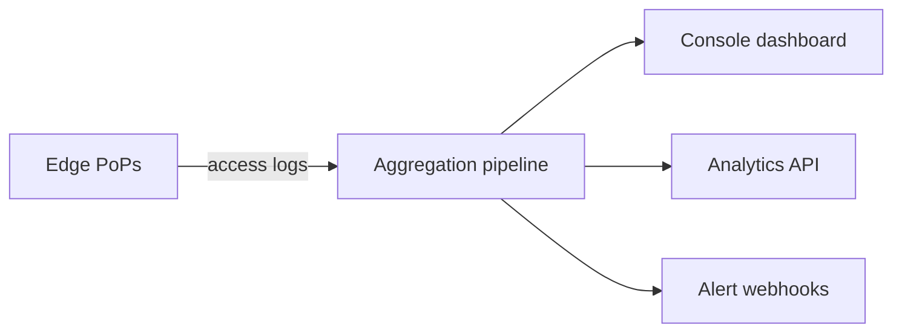

The Analytics tab shows real-time and historical metrics for a distribution. Use it to validate cache tuning, monitor traffic, and catch error spikes early.

## Metrics at a glance



| Metric | Why it matters | Page |
|--------|----------------|------|
| **Traffic served** | Bandwidth out — drives bill and capacity planning. | [Traffic served](/docs/cdn/analytics/traffic-reports) |
| **Requests served** | Volume — sizes infra and tracks adoption. | [Requests served](/docs/cdn/analytics/request-served) |
| **Cache hit ratio** | Efficiency — high HIT% = low origin cost and latency. | [Cache hit ratio](/docs/cdn/analytics/cache-hit-ratio) |
| **Response classes** | Health — non-2xx counts catch outages and bad deploys. | [Response classes](/docs/cdn/analytics/response-classes) |

## Healthy baselines

| Metric | Good | Investigate |
|--------|------|-------------|
| Cache hit ratio (static) | ≥ 95% | < 90% |
| Cache hit ratio (mixed) | ≥ 80% | < 70% |
| 4xx rate | < 1% of total | sustained > 2% |
| 5xx rate | < 0.1% of total | any sustained spike |
| Traffic week-over-week | within ±20% | sudden 2× without launch |

These are starting points; tune to your workload.

## Pull metrics via API

```bash
curl -sS "https://api.tenbyte.io/cdn/distributions/$DISTRIBUTION_ID/analytics?from=2026-05-01T00:00:00Z&to=2026-05-09T00:00:00Z" \
  -H "Authorization: Bearer $TENBYTE_API_TOKEN" | jq
```

Common response fields:

```json
{
  "bandwidth_bytes": 12834567890,
  "requests": 4501234,
  "cache_hit_ratio": 0.92,
  "responses": {"2xx": 4456012, "3xx": 12000, "4xx": 33000, "5xx": 222}
}
```

See the [CDN API reference](/api-reference/cdn) for the canonical endpoint and filters.

## Wire into your stack

| Destination | How |
|-------------|-----|
| **Grafana** | Use the Tenbyte API as a JSON datasource; chart `bandwidth_bytes`, `requests`, `cache_hit_ratio`. |
| **Datadog** | Cron a small lambda that pulls the API and pushes custom metrics. |
| **Slack alerts** | Configure webhook on response-class spike via the distribution settings. |
| **Spreadsheet** | Pipe daily totals to a CSV for finance / capacity reporting. |

## Operational tips

- **Compare deploys, not days.** A weekday/weekend baseline beats raw deltas.
- **Alert on ratios, not absolutes.** Traffic doubles, errors stay flat — that's healthy growth, not an incident.
- **Drill in by path.** Filter by URL prefix to find the noisy 4xx contributor before it becomes a 5xx.
- **Pair with origin metrics.** Edge `5xx` plus origin `5xx` = origin issue; edge `5xx` only = networking or config.
