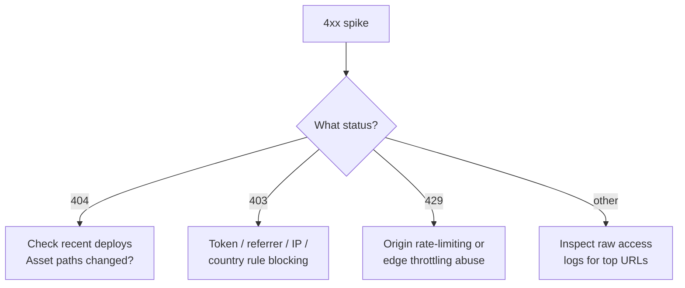
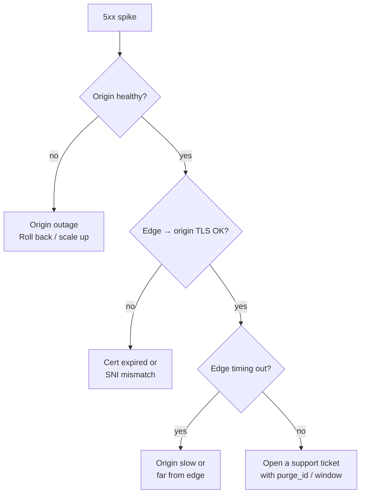

Response Classes breaks down HTTP status codes the CDN returned to clients. The non-2xx panel surfaces problems — bad URLs, blocked traffic, origin failures — before users complain.

<Frame caption="Response Classes">
    
</Frame>

## Status code map

| Class | Meaning | Common causes |
|-------|---------|---------------|
| **2xx** | Success | Healthy traffic. |
| **3xx** | Redirect | HTTP→HTTPS, canonical-URL redirects. |
| **4xx** | Client error | `404` for missing assets, `403` from access rules, `429` rate-limited. |
| **5xx** | Server error | Origin down, TLS handshake failed, edge timeout. |

## How to read the panel

| Element | Meaning |
|---------|---------|
| 4xx counter | Count of client-side errors in the window. Yellow series. |
| 5xx counter | Count of server-side errors. Red series. |
| Time-series chart | Distribution over time — find spikes. |

## Pull via API

```bash
curl -sS "https://api.tenbyte.io/cdn/distributions/$DISTRIBUTION_ID/analytics/responses?from=2026-05-01T00:00:00Z&to=2026-05-09T00:00:00Z&granularity=hour" \
  -H "Authorization: Bearer $TENBYTE_API_TOKEN" | jq
```

```json
{
  "totals": {"2xx": 4456012, "3xx": 12000, "4xx": 33000, "5xx": 222},
  "series": [
    {"ts": "2026-05-01T00:00:00Z", "2xx": 1923000, "4xx": 1500, "5xx": 12}
  ]
}
```

## Diagnose a 4xx spike



| Status | Likely cause | Action |
|--------|--------------|--------|
| `404` | Stale URLs after a deploy, broken `` `srcset`, robots probing. | Audit recent deploys, fix references, consider a `404` cache rule. |
| `403` | [Access rule](/docs/cdn/distributions/access-rules/overview) blocked the request. | Inspect rule logs; verify intended audience can pass. |
| `401` | Origin rejected an auth-protected path. | Check upstream credentials. |
| `405` | Method not allowed. | Origin or rule disallows verb (often `OPTIONS` preflight). |
| `429` | Rate limit hit. | Check origin throttling and edge protection settings. |

## Diagnose a 5xx spike



| Status | Likely cause | Action |
|--------|--------------|--------|
| `502` | Origin unreachable, dropped connection, TLS failure. | Check origin health and certs. |
| `503` | Origin overloaded or returning `Retry-After`. | Scale origin; consider edge `Retry-After` aware caching. |
| `504` | Edge timed out waiting for origin. | Investigate origin latency; raise timeouts only as a last resort. |

## Operational tips

- **Alert on rate, not absolute count.** `5xx > 0.1% of requests for 5 min` beats a fixed threshold across distributions of different size.
- **Correlate with deploys.** Most 4xx spikes are deploys with stale paths; first action on a spike is "what shipped?"
- **Cache `404`s briefly.** A short TTL on `404` cuts origin load during a probe storm. Configure via [cache rules](/docs/cdn/distributions/cache-rules).
- **Watch the edge → origin TLS expiry.** A silent cert renewal failure shows up as `502`.
- **Combine with [Cache hit ratio](/docs/cdn/analytics/cache-hit-ratio).** Falling CHR + rising 5xx = origin couldn't keep up with the cold-start spike.
