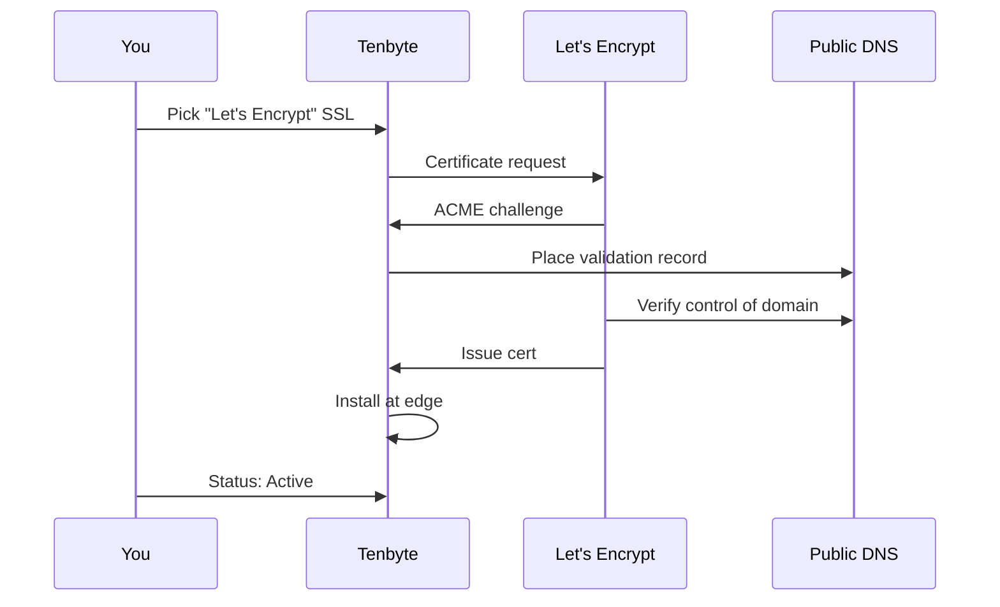

Let's Encrypt issues free, domain-validated TLS certificates that auto-renew. It's the right default for any custom domain on Tenbyte CDN.

## When to use Let's Encrypt

- You have a custom domain (`cdn.yoursite.com`) on a Tenbyte CDN distribution.
- Domain Validation (DV) is sufficient — no green-bar EV / OV needed.
- You want zero-touch renewal.

For EV / OV / wildcard / internal CA, see [Custom certificates](/docs/cdn/certificates/custom-certificates).

## How it works



Renewal runs automatically about 30 days before `notAfter`.

## Prerequisites

- Custom domain configured on the distribution. See [SSL settings](/docs/cdn/distributions/ssl).
- A DNS CNAME from your domain to the distribution hostname:
  ```text
  cdn.yoursite.com.   300   IN   CNAME   your-distribution.tenbytecdn.com.
  ```
- DNS resolves publicly — Let's Encrypt verifies from the public internet.

Verify before requesting:

```bash
dig +short cdn.yoursite.com CNAME
# cdn.yoursite.com.   CNAME   your-distribution.tenbytecdn.com.
```

## Issue the certificate

1. Open the distribution → **SSL** tab.
2. Choose **Let's Encrypt**.
3. Click **Issue certificate**.
4. Status moves through: `Pending validation` → `Issuing` → `Active`.

Most certs issue within a minute. If it stalls in `Pending`, the DNS isn't pointing at the distribution yet — wait for the TTL to expire and try again.

## Verify

```bash
openssl s_client -connect cdn.yoursite.com:443 -servername cdn.yoursite.com </dev/null \
  2>/dev/null | openssl x509 -noout -subject -issuer -dates
```

Expected:

```text
subject=CN = cdn.yoursite.com
issuer=C = US, O = Let's Encrypt, CN = R3
notBefore=May  9 00:00:00 2026 GMT
notAfter=Aug  7 23:59:59 2026 GMT
```

## Renewal

| Event | What happens |
|-------|--------------|
| ~30 days before `notAfter` | Tenbyte requests a renewal automatically. |
| Validation succeeds | New cert is hot-swapped at the edge — zero downtime. |
| Validation fails | Webhook + console alert fires. |

You don't need to do anything. If renewal fails, the most common cause is the DNS CNAME was changed or removed.

## Limitations

- **DV only.** No organizational identity in the cert.
- **No wildcards by default.** Use a custom cert if you need `*.yoursite.com`.
- **Public DNS only.** Internal-only domains can't validate; use a custom cert from your internal CA.
- **Rate limits.** Let's Encrypt limits per registered domain (50 certs / week / domain). Plenty for production but worth knowing for spin-up scripts.

## Troubleshooting

| Symptom | Fix |
|---------|-----|
| Stuck at `Pending validation` | DNS not resolving to the distribution. `dig +short` and confirm. |
| Stuck at `Issuing` | Let's Encrypt rate limit hit, or transient ACME outage. Retry after 1 h. |
| Cert active but browser shows mismatch | DNS resolves to the wrong distribution, or you changed the hostname after issuing — re-issue. |
| Renewal failed alert | Confirm CNAME still points at the distribution. Re-issue if it changed. |

## Related

- [SSL Overview](/docs/cdn/certificates/ssl-overview) — pick the right cert type.
- [SSL settings](/docs/cdn/distributions/ssl) — toggle HTTPS redirect, HTTP/2, HTTP/3.
- [Custom certificates](/docs/cdn/certificates/custom-certificates) — bring your own.
