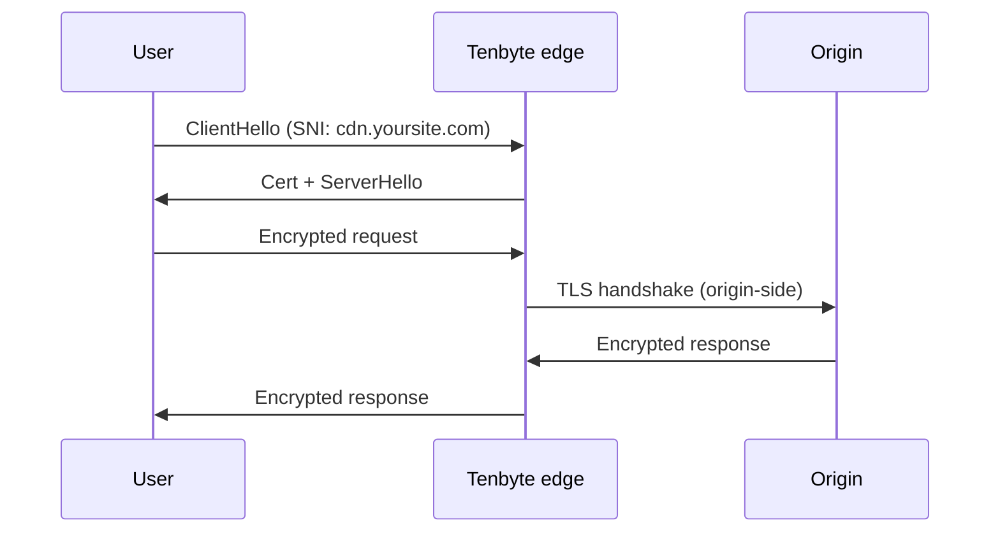
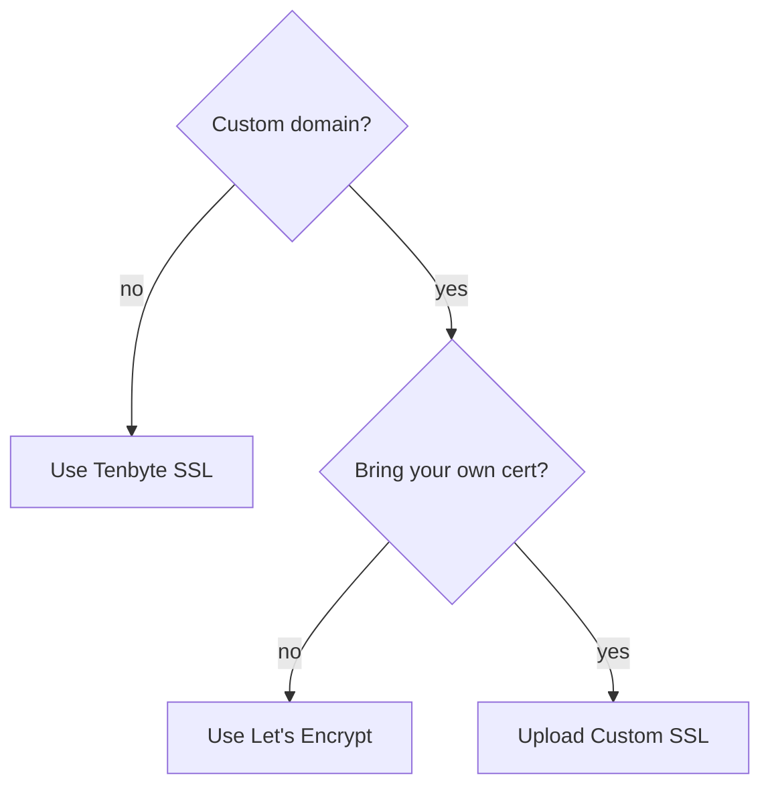

Every Tenbyte CDN distribution serves over TLS. You pick how the certificate is provisioned: a free Tenbyte cert, automated Let's Encrypt, or a custom cert you upload. This page explains the trade-offs; the per-type pages walk through setup.

## TLS at the edge



Two TLS sessions exist: client ↔ edge (using the cert on this page) and edge ↔ origin (using your origin's cert). They are independent.

## Choose a certificate type

| Type | Cost | Auto-renew | Best for |
|------|------|------------|----------|
| **Tenbyte SSL (Free)** | Free | Yes | The system-generated `*.tenbytecdn.com` host. Zero setup. |
| **[Let's Encrypt](/docs/cdn/certificates/lets-encrypt)** | Free | Yes (~30 days before expiry) | Custom domains where you control DNS. |
| **[Custom SSL](/docs/cdn/certificates/custom-certificates)** | Whatever you paid your CA | **No** — you renew | EV / OV certs, wildcards across many subdomains, internal CA, certs your security team manages. |

## Decision flow



## What's included regardless of type

- **TLS 1.2 + 1.3** with modern cipher suites.
- **HTTP/2** and **HTTP/3 (QUIC)** offered when negotiated.
- **OCSP stapling** for fast revocation checks.
- **SNI** for multi-tenant edge routing.

## Operational checklist

- [ ] Custom domain CNAMEs to your distribution.
- [ ] Cert covers the exact hostname (no wildcard surprises).
- [ ] HTTPS redirect is on for production traffic. See [SSL settings](/docs/cdn/distributions/ssl).
- [ ] HSTS configured via [response headers](/docs/cdn/distributions/headers) once you're sure all subdomains are HTTPS.
- [ ] Custom certs: calendar reminder set 30 days before `notAfter`.

## Verify a cert

```bash
openssl s_client -connect cdn.yoursite.com:443 -servername cdn.yoursite.com </dev/null \
  2>/dev/null | openssl x509 -noout -subject -issuer -dates
```

For a deeper grade, run [SSL Labs](https://www.ssllabs.com/ssltest/).

## Related

- [SSL configuration](/docs/cdn/distributions/ssl) — pick the type and toggle HTTP/2/3 / redirects.
- [Custom certificates](/docs/cdn/certificates/custom-certificates) — upload PEM, manage chain, renew.
- [Let's Encrypt](/docs/cdn/certificates/lets-encrypt) — automated DV cert flow.
