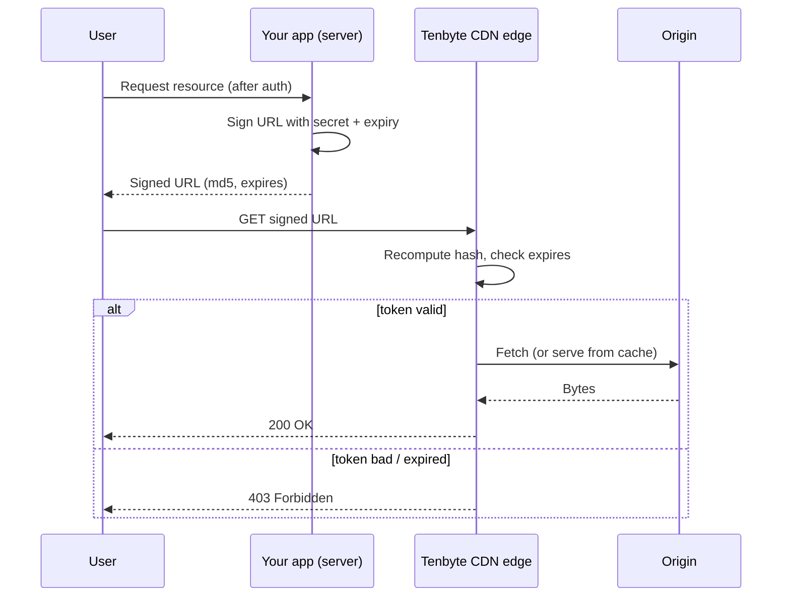

Token authentication protects content with **time-limited signed URLs**. Each URL carries an MD5-based token plus an expiry timestamp; the CDN edge validates both before serving the file. Links expire on schedule and cannot be tampered with — the secret never leaves your server.

Use it for HLS / DASH streams, private downloads, embedded video players, and any media you want gated behind your application's auth.

## Request flow



The secret stays on your server. Clients only ever see the finished signed URL.

## Enable token authentication

<Frame caption="Token Authentication">
    
</Frame>

1. Open **CDN** → **Distributions** → select your distribution.
2. Go to **Access Rules** → **Add Access Rules** (or open an existing rule).
3. Set the **Match Pattern** to the path you want to protect (for example `/videos/*`).
4. Toggle **Token Authentication** on.
5. Click **Generate Token** to mint a **Secret Token**, then **Copy Token**.
6. Click **Create Access Rules** to save.

<Note>
    Token authentication is configured **per access rule**, not globally. Each rule has its own secret, so you can scope tokens to a path prefix and rotate them independently.
</Note>

<Warning>
    Treat the secret like a database password. Store it in your secret manager (AWS Secrets Manager, GCP Secret Manager, Vault, Doppler, etc.), inject it via environment variable, and never commit it to a repo or expose it in client-side code.
</Warning>

## URL anatomy

```
https://<distribution>.tenbytecdn.com/<path>?md5=<token>&expires=<unix_ts>
```

| Part | Source | Notes |
|------|--------|-------|
| `<distribution>` | Your distribution hostname | Can be a custom domain CNAMEd to the distribution. |
| `<path>` | Path to the asset | Must start with `/`. Must match the access rule's **Match Pattern**, otherwise the rule is skipped. |
| `md5` | Computed token | URL-safe base64 of the MD5 hash. No `+`, `/`, or `=`. |
| `expires` | Unix timestamp (seconds) | After this, the edge returns `403`. |

## Signing algorithm

1. Build the string `{expires}{path} {secret}` — note the **single space** before the secret.
2. MD5 hash with **raw binary** output (16 bytes), not hex.
3. Base64-encode the binary hash.
4. Make the base64 URL-safe: replace `+` → `-`, `/` → `_`, strip `=` padding.
5. Append `?md5={token}&expires={unix_timestamp}` to the CDN URL.

## Configuration

Drive everything from environment variables — never hard-code the secret.

```bash .env
TENBYTE_CDN_HOST=https://your-distribution.tenbytecdn.com
TENBYTE_CDN_SECRET=replace-with-secret-from-console
TENBYTE_CDN_TTL=1800
```

| Variable | Description | Example |
|----------|-------------|---------|
| `TENBYTE_CDN_HOST` | Distribution hostname (no trailing slash) | `https://your-distribution.tenbytecdn.com` |
| `TENBYTE_CDN_SECRET` | Secret token from the access rule | injected at runtime |
| `TENBYTE_CDN_TTL` | Token lifetime in seconds | `1800` (30 min) |

## Generate signed URLs

<Tip>
    Reference implementations live in the [tenbyte-cdn-signed-url-example](https://github.com/vidinfra/tenbyte-cdn-signed-url-example) repo. Pick a language, copy the function, swap your config.
</Tip>

<CodeGroup>

```php PHP
<?php
/**
 * @param string $cdnHost  Distribution host, e.g. "https://xxx.tenbytecdn.com"
 * @param string $path     Resource path, must start with "/"
 * @param string $secret   CDN secret token (server-side only)
 * @param int    $ttl      Token lifetime in seconds (default 1800)
 */
function tenbyteSignedUrl(
    string $cdnHost,
    string $path,
    string $secret,
    int $ttl = 1800
): string {
    $expires = time() + $ttl;

    $link = "$expires$path $secret";
    $md5 = md5($link, true);
    $md5 = base64_encode($md5);
    $md5 = strtr($md5, "+/", "-_");
    $md5 = str_replace("=", "", $md5);

    $cdnHost = rtrim($cdnHost, "/");

    return "{$cdnHost}{$path}?md5={$md5}&expires={$expires}";
}

$url = tenbyteSignedUrl(
    getenv("TENBYTE_CDN_HOST"),
    "/videos/sample/index.m3u8",
    getenv("TENBYTE_CDN_SECRET"),
    (int) (getenv("TENBYTE_CDN_TTL") ?: 1800)
);
echo $url, "\n";
```

```go Go
package main

import (
    "crypto/md5"
    "encoding/base64"
    "fmt"
    "os"
    "strconv"
    "strings"
    "time"
)

// TenbyteSignedURL builds a signed Tenbyte CDN URL.
//
//   cdnHost  distribution host, e.g. "https://xxx.tenbytecdn.com"
//   path     resource path, must start with "/"
//   secret   CDN secret token (server-side only)
//   ttl      token lifetime
func TenbyteSignedURL(cdnHost, path, secret string, ttl time.Duration) string {
    expires := time.Now().Add(ttl).Unix()

    link := fmt.Sprintf("%d%s %s", expires, path, secret)
    sum := md5.Sum([]byte(link))

    token := base64.StdEncoding.EncodeToString(sum[:])
    token = strings.NewReplacer("+", "-", "/", "_").Replace(token)
    token = strings.ReplaceAll(token, "=", "")

    cdnHost = strings.TrimRight(cdnHost, "/")

    return fmt.Sprintf("%s%s?md5=%s&expires=%d", cdnHost, path, token, expires)
}

func main() {
    ttlSec, _ := strconv.Atoi(os.Getenv("TENBYTE_CDN_TTL"))
    if ttlSec == 0 {
        ttlSec = 1800
    }

    url := TenbyteSignedURL(
        os.Getenv("TENBYTE_CDN_HOST"),
        "/videos/sample/index.m3u8",
        os.Getenv("TENBYTE_CDN_SECRET"),
        time.Duration(ttlSec)*time.Second,
    )
    fmt.Println(url)
}
```

```javascript Node.js
const crypto = require("crypto");

/**
 * @param {string} cdnHost     Distribution host
 * @param {string} path        Resource path, must start with "/"
 * @param {string} secret      CDN secret token (server-side only)
 * @param {number} ttlSeconds  Token lifetime in seconds
 * @returns {string}           Signed URL
 */
function tenbyteSignedUrl(cdnHost, path, secret, ttlSeconds = 1800) {
  const expires = Math.floor(Date.now() / 1000) + ttlSeconds;

  const link = `${expires}${path} ${secret}`;

  let md5 = crypto.createHash("md5").update(link).digest("base64");
  md5 = md5.replace(/\+/g, "-").replace(/\//g, "_").replace(/=+$/, "");

  cdnHost = cdnHost.replace(/\/+$/, "");

  return `${cdnHost}${path}?md5=${md5}&expires=${expires}`;
}

module.exports = { tenbyteSignedUrl };

if (require.main === module) {
  const url = tenbyteSignedUrl(
    process.env.TENBYTE_CDN_HOST,
    "/videos/sample/index.m3u8",
    process.env.TENBYTE_CDN_SECRET,
    Number(process.env.TENBYTE_CDN_TTL) || 1800
  );
  console.log(url);
}
```

```python Python
import base64
import hashlib
import os
import time


def tenbyte_signed_url(cdn_host: str, path: str, secret: str, ttl: int = 1800) -> str:
    """Build a signed Tenbyte CDN URL.

    cdn_host: distribution host, e.g. "https://xxx.tenbytecdn.com"
    path: resource path, must start with "/"
    secret: CDN secret token (server-side only)
    ttl: token lifetime in seconds (default 1800)
    """
    expires = int(time.time()) + ttl
    link = f"{expires}{path} {secret}".encode()

    digest = hashlib.md5(link).digest()
    token = base64.b64encode(digest).decode()
    token = token.replace("+", "-").replace("/", "_").rstrip("=")

    return f"{cdn_host.rstrip('/')}{path}?md5={token}&expires={expires}"


if __name__ == "__main__":
    print(tenbyte_signed_url(
        os.environ["TENBYTE_CDN_HOST"],
        "/videos/sample/index.m3u8",
        os.environ["TENBYTE_CDN_SECRET"],
        int(os.environ.get("TENBYTE_CDN_TTL", 1800)),
    ))
```

```lua Lua
-- Standalone Lua: requires "md5" and "lbase64" from luarocks.
-- OpenResty: see ngx variant below.

local md5_lib = require("md5")
local base64  = require("base64")

local function tenbyte_signed_url(cdn_host, path, secret, ttl)
    ttl = ttl or 1800
    local expires = os.time() + ttl

    local link = expires .. path .. " " .. secret

    local raw = md5_lib.sum(link)
    local token = base64.encode(raw)

    token = token:gsub("%+", "-"):gsub("/", "_"):gsub("=", "")
    cdn_host = cdn_host:gsub("/+$", "")

    return string.format("%s%s?md5=%s&expires=%d", cdn_host, path, token, expires)
end

print(tenbyte_signed_url(
    os.getenv("TENBYTE_CDN_HOST"),
    "/videos/sample/index.m3u8",
    os.getenv("TENBYTE_CDN_SECRET"),
    tonumber(os.getenv("TENBYTE_CDN_TTL")) or 1800
))
```

```lua OpenResty
-- Drop-in for OpenResty / Nginx with lua-nginx-module.
-- No luarocks needed.

local function tenbyte_signed_url(cdn_host, path, secret, ttl)
    ttl = ttl or 1800
    local expires = ngx.time() + ttl
    local link = expires .. path .. " " .. secret
    local token = ngx.encode_base64(ngx.md5_bin(link))
    token = token:gsub("%+", "-"):gsub("/", "_"):gsub("=", "")
    cdn_host = cdn_host:gsub("/+$", "")
    return string.format("%s%s?md5=%s&expires=%d", cdn_host, path, token, expires)
end
```

</CodeGroup>

## Verify with curl

Mint a URL, hit the edge, expect `200`:

```bash
SIGNED_URL="$(node js/index.js)"   # or php/go/python equivalent
curl -sSI "$SIGNED_URL" | head -1
# HTTP/2 200
```

Negative tests — both should return `403`:

```bash
# Tampered path (token won't match)
curl -sSI "${SIGNED_URL/index.m3u8/secret.m3u8}" | head -1

# Expired
curl -sSI "${SIGNED_URL/expires=*/expires=1}" | head -1
```

## Use the URL in a player

The signed URL is a normal HTTPS URL — drop it into any player. For HLS streams, sign the manifest only; segments inherit the rule as long as the **Match Pattern** covers them.

<CodeGroup>

```html HTML5 video
<video controls src="https://your-distribution.tenbytecdn.com/videos/sample/index.m3u8?md5=...&expires=..."></video>
```

```javascript hls.js
import Hls from "hls.js";

const res = await fetch("/api/stream/123");   // your backend signs the URL
const { url } = await res.json();

const video = document.querySelector("video");
if (Hls.isSupported()) {
  const hls = new Hls();
  hls.loadSource(url);
  hls.attachMedia(video);
} else {
  video.src = url;   // Safari / native HLS
}
```

</CodeGroup>

## Operations

### Choosing a TTL

| Workload | Suggested TTL | Why |
|----------|---------------|-----|
| Image / thumbnail | 60–300 s | Short request, easy to re-sign on retry. |
| Private download | 5–15 min | Long enough for a slow connection, short enough to limit URL sharing. |
| HLS / DASH live | 1–4 h | Must outlast the session: full playback + ABR switches + pause/resume. |
| HLS VOD | 2–6 h | Should cover the longest expected viewing session in one URL. |

Set TTL ≥ longest possible playback session. If a viewer pauses past the expiry, the next segment fetch returns `403` and the player stalls.

### Clock skew

`expires` is compared against the edge's wall clock. Servers signing URLs should run NTP. If your sign host drifts ahead, the edge sees a token that is "already expired"; if it drifts behind, tokens live longer than expected. A skew of ±60 seconds is usually invisible — anything more is a config issue.

### Rotating the secret

The console only stores **one** active secret per access rule. Rotation is a hard cutover, so do it at low traffic and keep a short overlap by issuing short-TTL tokens leading up to the swap.

```text
T-1h    Drop new sign-time TTL to 5 min so old tokens age out fast
T-0     Click Regenerate, copy new secret
T-0+s   Push new secret to your secret manager / app config
T-0+m   Restart / reload signing services
T+5m    Old tokens fully expired — back to normal TTL
```

### Multiple environments

Use **one access rule per environment** with its own secret and a path prefix that namespaces traffic — for example `/prod/*` and `/staging/*`. That way a leaked staging secret cannot sign production URLs.

### Logging and observability

- Log the **path** you signed and **expires** value, never the secret or the full signed URL — query strings often end up in access logs.
- Track edge `403` rate per access rule. A spike usually means clock skew, expired tokens, or a bug in your signer.
- For incident triage, keep the signing function pure (input in, URL out) so you can replay it offline against suspect timestamps.

## Security checklist

- [ ] Secret stored in a secret manager, injected via env var.
- [ ] Signing happens **only** on the server. No browser code, no mobile-client embedded secrets.
- [ ] Per-environment access rules with distinct secrets.
- [ ] TTL is the shortest value your workload tolerates.
- [ ] Rotation runbook documented and tested.
- [ ] Application auth gates the signer endpoint — never let an unauthenticated request mint a URL.
- [ ] Combine with [Referrer](/docs/cdn/distributions/access-rules/referrer-access-policy), [IP](/docs/cdn/distributions/access-rules/ip-access-policy), or [Country](/docs/cdn/distributions/access-rules/country-access-policy) policies for defense in depth.

## Troubleshooting

| Problem | Fix |
|---------|-----|
| `403 Forbidden` on a fresh URL | Path doesn't match the rule's **Match Pattern**, or your sign host's clock is ahead of the edge. Check `date -u` and the rule pattern. |
| Token works in PHP but not Go / Node / Python | MD5 must be **raw binary** before base64, not the hex string. |
| URL contains `+` or `/` and breaks | Apply the URL-safe base64 step (`+` → `-`, `/` → `_`). |
| Trailing `=` in token causes `403` | Strip all `=` padding. |
| Manifest plays, segments `403` | Access rule pattern only covers the manifest. Broaden the pattern (e.g. `/videos/*`) so segment paths match. |
| Works in `curl` but not the browser | Browser cached an old manifest. Bust cache or use a fresh signed URL. |
| Intermittent `403` near expiry | TTL too short for the session. Bump TTL or re-sign on player error. |
