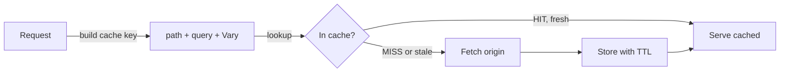

Cache rules tell the edge how long to keep a response and what counts as the same response. A high cache-hit ratio is the cheapest way to lower origin load and improve P95 latency.

## How the edge cache works



The edge stores responses keyed by URL (and selected headers / query params). On the next request for the same key, it serves the cached copy until TTL expires.

## General Info

<Frame caption="General Info">
    
</Frame>

| Field | Notes |
|-------|-------|
| **Rule Name** | Internal label. |
| **Rule Type** | `Prefix` (URL starts with) or `Regex` (full pattern match). |
| **Match Pattern** | Must start with `/`. No spaces. No leading `*`. |
| **Expiration Time** | TTL in the cache. |

## Rule Configurations

<Frame caption="Rule Configurations">
    
</Frame>

| Toggle | Effect | Use when |
|--------|--------|----------|
| **Ignore Origin Server No Cache** | Cache the response even if origin sends `Cache-Control: no-cache` / `private`. | Origin you don't fully control still sends `private` for cacheable assets. |
| **Ignore Client No Cache** | Ignore `Cache-Control: no-cache` from the client. | Block clients from forcing origin fetches (DDoS-ish). |
| **Never Cache** | Bypass cache entirely. | Per-user dashboards, auth callbacks, anything tied to identity. |
| **Ignore Query String in Cache Key** | Drop `?...` when computing the cache key. | Tracking-only params (`utm_*`, `fbclid`) — same content, many URLs. |
| **Gzip Compression** | Serve compressed responses to clients that send `Accept-Encoding`. | Text-heavy assets (HTML, CSS, JS, JSON, SVG). |

<Warning>
    Enabling **Ignore Query String in Cache Key** on a path with legitimate variant query strings (e.g. `?w=400` for image resize) collapses every variant to the same cache entry. Scope the rule to a precise prefix.
</Warning>

## TTL recipes

| Asset | Cache-Control | Expiration | Notes |
|-------|---------------|------------|-------|
| Hashed JS / CSS / fonts (`/static/abc123.js`) | `public, max-age=31536000, immutable` | 1 y | Filename changes invalidate naturally. |
| Images (versioned by path) | `public, max-age=2592000` | 30 d | Refresh on path change. |
| HTML entry point | `public, max-age=60, must-revalidate` | 60 s | Fast deploys, low risk of stale shell. |
| API GET (idempotent) | `public, max-age=10` | 10 s | Tiny TTL still flattens spikes. |
| User-specific JSON | n/a (Never Cache) | n/a | Privacy + correctness. |
| HLS / DASH segment | `public, max-age=10` | match segment duration | Live streams: TTL ≤ segment duration. |
| HLS manifest | `public, max-age=2` | 2 s | Refreshes ABR ladder updates. |

## Verify cache behavior

```bash
# 1. Warm the cache
curl -sSI "$CDN_HOST/static/main.js" >/dev/null

# 2. Confirm HIT and inspect TTL
curl -sSI "$CDN_HOST/static/main.js" \
  | grep -iE 'http/|x-cache|cache-control|age'
```

Expected:

```text
HTTP/2 200
cache-control: public, max-age=31536000, immutable
x-cache: HIT
age: 42
```

`age` is seconds since the edge cached this object. When `age` approaches `max-age`, the next request triggers a revalidation.

## Cache key tuning

By default the cache key is `host + path + sorted query string`. You typically want to drop:

- **Tracking params** — `utm_*`, `fbclid`, `gclid`. They don't change the response.
- **Session-style params** — only on truly static assets.

Use a regex rule with **Ignore Query String in Cache Key** on the static prefix only.

## Compression

Tenbyte CDN supports Gzip (and increasingly Brotli) at the edge. Enable on text-based MIME types only — already-compressed binary (images, video, archives) gains nothing.

```bash
curl -sSI -H "Accept-Encoding: gzip" "$CDN_HOST/static/main.js" \
  | grep -i content-encoding
# content-encoding: gzip
```

## Manage via API

```bash
curl -X POST "https://api.tenbyte.io/cdn/distributions/$DISTRIBUTION_ID/cache-rules" \
  -H "Authorization: Bearer $TENBYTE_API_TOKEN" \
  -H "Content-Type: application/json" \
  -d '{
    "name": "static-assets-1y",
    "rule_type": "prefix",
    "match_pattern": "/static/",
    "expiration_seconds": 31536000,
    "ignore_origin_no_cache": true,
    "ignore_query_string_in_key": true,
    "gzip_compression": true
  }'
```

See the [CDN API reference](/api-reference/cdn) for canonical fields.

## Operational tips

- **Tune by hit ratio.** [Cache hit ratio](/docs/cdn/analytics/cache-hit-ratio) below 80% on static content usually means a noisy query string or wrong TTL.
- **Stale-while-revalidate where supported.** Origin can emit `Cache-Control: max-age=60, stale-while-revalidate=86400` for a smooth deploy story.
- **Don't `Never Cache` everything.** Even short TTLs (5–10 s) blunt traffic spikes hard.
- **Purge before changing TTL down.** A long-cached object stays cached for the original TTL — cut TTL **and** [purge](/docs/cdn/purge/purge-by-pattern) to roll out.
- **Watch `Vary`.** Origin returning `Vary: User-Agent` fragments the cache by browser. Strip or narrow at the edge.

## Troubleshooting

| Symptom | Likely cause |
|---------|--------------|
| `x-cache: MISS` every request | Origin sends `Cache-Control: private` / `no-store`, or **Never Cache** is on. |
| `x-cache: HIT` but stale content | TTL too long. Purge the path and lower the rule's TTL. |
| Cache entries explode for one URL | Cache key includes a noisy query string. Enable Ignore Query String for that prefix. |
| Compressed response missing on text | Gzip not enabled or origin already returned `Content-Encoding: identity`. |
