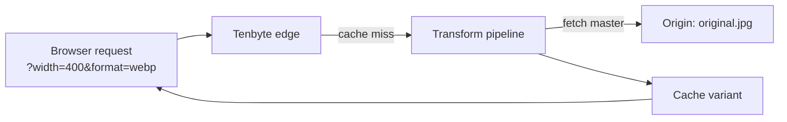

Image Optimizer transforms images on the fly at the edge: resize, format conversion (WebP / AVIF), quality, crop, and more. You ship one master file to your origin and the CDN serves the perfect variant per device.

## How it works



The query string is part of the cache key, so each variant is cached independently after the first miss.

## Enable Image Optimizer

<Frame caption="Turn on Image Optimizer">
    
</Frame>

Click **Turn on Image Optimizer**. Once active:

<Frame caption="Image Optimizer in Action">
    
</Frame>

The status flips to **Image Optimizer is Active**. Transforms work immediately on any image path on this distribution.

## URL-based transforms

Append query parameters to any image URL.

| Parameter | Values | Example |
|-----------|--------|---------|
| `width` | px | `?width=800` |
| `height` | px | `?height=600` |
| `format` | `auto`, `webp`, `avif`, `jpeg`, `png` | `?format=webp` |
| `quality` | `1–100` | `?quality=80` |
| `fit` | `cover`, `contain`, `fill`, `inside`, `outside` | `?fit=cover` |
| `dpr` | device pixel ratio | `?dpr=2` |

Combine freely:

```text
https://cdn.yoursite.com/photos/hero.jpg?width=1200&format=auto&quality=80
```

`format=auto` picks WebP / AVIF based on `Accept` header; falls back to the original.

## Recipes

### Responsive image

```html

```

### Avatar thumbnail

```text
https://cdn.yoursite.com/users/123.jpg?width=64&height=64&fit=cover&format=webp
```

### High-DPI screen

```text
https://cdn.yoursite.com/photos/hero.jpg?width=800&dpr=2&format=auto
```

## Verify a transform

```bash
curl -sSI "$CDN_HOST/photos/hero.jpg?width=400&format=webp" \
  | grep -iE 'content-type|content-length|x-cache'
```

Expected:

```text
content-type: image/webp
content-length: 18432
x-cache: HIT
```

## Framework integration

Drop straight into your front-end framework. Per-framework guides:

- [Next.js](/docs/cdn/image-optimization/integration-guide/nextjs)
- [Nuxt](/docs/cdn/image-optimization/integration-guide/nuxt)
- [Astro](/docs/cdn/image-optimization/integration-guide/astro)
- [React Native](/docs/cdn/image-optimization/integration-guide/react-native)
- [Android / iOS](/docs/cdn/image-optimization/integration-guide/android-ios)
- [Shopify](/docs/cdn/image-optimization/integration-guide/shopify)

## Turn off

<Frame caption="Turn off Image Optimizer">
    
</Frame>

Click **Turn Off**. The CDN stops transforming and serves the master file as-is. Cached variants stay until they expire — [purge](/docs/cdn/purge/purge-by-pattern) `/photos/*` to flush them immediately.

## Operational tips

- **Master in a high-quality format** — JPEG quality 90 or PNG. Let the optimizer downscale; never upscale.
- **`format=auto` everywhere** — covers AVIF-capable Chrome, WebP for everything else, JPEG for old Safari.
- **Cap `width`** — limit the transform to widths you actually use (sizes attribute). Otherwise attackers can hammer the edge with `?width=N` for every N.
- **Watch the cache.** Each `(width, height, format, quality, dpr, fit)` tuple is a separate object. Define a small set in your component layer.
- **Pair with [cache rules](/docs/cdn/distributions/cache-rules)** — long TTLs on `/photos/*` since transforms are deterministic per query.
