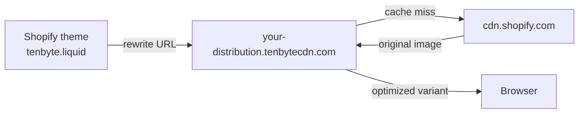

Shopify hosts your product images on `cdn.shopify.com`. By proxying that origin through Tenbyte CDN, you get on-the-fly resizing, format conversion, and faster regional delivery without changing how you upload products.

## How the integration works



The `tenbyte.liquid` snippet rewrites Shopify CDN URLs to Tenbyte URLs and appends transform params.

## Prerequisites

- A Shopify store with theme edit access.
- A Tenbyte distribution with [Image Optimizer enabled](/docs/cdn/distributions/image-optimizer).
- **Backup your theme** before editing — Online Store → Themes → "..." → Download theme file.

## 1. Add Shopify as an origin

In your Tenbyte distribution → **Origins** → **Add Origin**:

| Field | Value |
|-------|-------|
| Origin Name | `Origin-Shopify` |
| Type | Hostname |
| Domain / IP | `https://cdn.shopify.com` |

<Frame caption="Add Shopify as an Origin">
    
</Frame>

Save. Your Tenbyte CDN domain can now fetch and optimize Shopify-hosted images.

<Frame caption="Domain Distribution URL">
    
</Frame>

## 2. Add Tenbyte settings to the theme

In Shopify Admin → **Online Store → Themes**, find your theme, click **"..." → Edit code**.

Open `Config/settings_schema.json`, scroll to the bottom, and append this block. Save.

```json settings_schema.json
{
  "name": "Tenbyte",
  "settings": [
    {
      "type": "paragraph",
      "content": "Tenbyte Image Optimization. See https://docs.tenbyte.io/docs/cdn/image-optimization/integration-guide/shopify"
    },
    {
      "type": "checkbox",
      "id": "enableTenbyte",
      "label": "Enable Tenbyte"
    },
    {
      "type": "text",
      "id": "tenbyteUrl",
      "label": "Tenbyte URL endpoint",
      "info": "Your Tenbyte distribution. Example: https://your-distribution.tenbytecdn.com/"
    },
    {
      "type": "text",
      "id": "tenbyteShopifyCdnUrl",
      "label": "Shopify CDN domain",
      "info": "Leave as //cdn.shopify.com unless you have a proxy in place."
    }
  ]
}
```

## 3. Create the `tenbyte.liquid` snippet

In **Snippets**, create `tenbyte.liquid` and paste:

```liquid tenbyte.liquid

  
    
      
        {{ src }}
      

      
      
        {{ src }}
      

      

      
      
      

      
        
          
        
      

      
      
    

    {{ newSrc | default:src }}
  
    {{ src }}
  
{{ TENBYTE | strip | replace:'  ' | strip_newlines }}
```

## 4. Enable Tenbyte in theme settings

**Online Store → Themes → Customize**. In the left panel, open the **Tenbyte** section under General settings:

| Field | Value |
|-------|-------|
| Enable Tenbyte | ✓ |
| Tenbyte URL endpoint | `https://your-distribution.tenbytecdn.com/` |
| Shopify CDN domain | `//cdn.shopify.com` |

## 5. Update theme image renders

Replace direct image renders with the snippet. The before/after pattern:

**Before:**

```liquid
{{ product.featured_image }}
```

**After:**

```liquid


```

### Responsive `srcset` example

```liquid



```

## Verify

1. Open a product page.
2. View source / inspect element.
3. Confirm image URLs go to `your-distribution.tenbytecdn.com` instead of `cdn.shopify.com`.
4. In DevTools Network, check `content-type: image/webp` on supported browsers.

```bash
# Or test directly
curl -sSI "https://your-distribution.tenbytecdn.com/s/files/1/.../photo.jpg?w=480&fm=auto" \
  | grep -iE 'content-type|x-cache'
```

## Operational tips

- **Ship behind the checkbox.** The `enableTenbyte` toggle lets you roll back instantly.
- **Test in a draft theme.** Edit a copy, preview, then publish.
- **Watch [cache hit ratio](/docs/cdn/analytics/cache-hit-ratio).** Shopify pages reuse images aggressively; CHR should climb past 95%.
- **Cap widths.** Match Shopify's preset image sizes (320, 480, 640, 960, 1280, 1600) so you don't fragment the cache.
- **Lazy-load below the fold.** `loading="lazy"` is supported in Liquid `` tags.

## Troubleshooting

| Symptom | Fix |
|---------|-----|
| Images still hit `cdn.shopify.com` | `enableTenbyte` is off or `tenbyteUrl` is blank in theme settings. |
| `404` from Tenbyte | Origin not added or wrong path; the path on Tenbyte must match Shopify's. |
| Layout shifts | Add `width` and `height` to `` so the browser reserves space. |
| Broken theme | Restore from the backup you took in step 0. |
