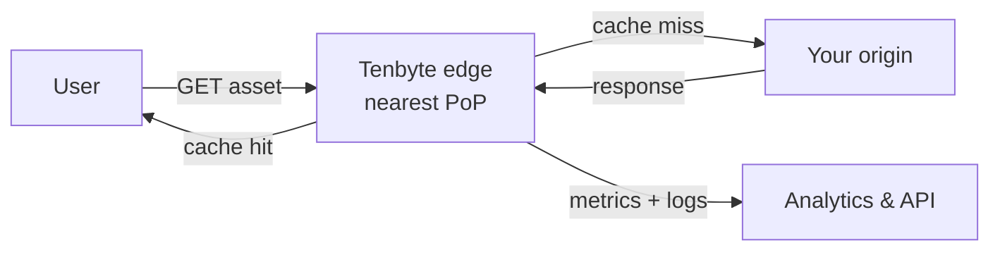

**Tenbyte CDN** is a global content delivery network that puts your static assets, video, and API responses on edge nodes close to your users. Lower latency, fewer origin hits, and a REST API and webhooks for automation.

## How it works

Requests hit the nearest edge PoP. On a cache miss the edge fetches from your origin, caches the response per your rules, and serves the next request locally.

## Core concepts

| Concept | What it is | Where to configure |
|---------|------------|--------------------|
| **Distribution** | A configured CDN endpoint mapped to one or more origins. | [Create distribution](/docs/cdn/distributions/create-distribution) |
| **Origin** | The upstream your distribution pulls from (HTTP, S3, custom). | [Origins](/docs/cdn/distributions/origins) |
| **Cache rule** | Per-path TTL, query-string handling, compression. | [Cache rules](/docs/cdn/distributions/cache-rules) |
| **Access rule** | Country / IP / referrer / token gate per path. | [Access rules](/docs/cdn/distributions/access-rules/overview) |
| **Header rule** | Add / remove request and response headers. | [Headers](/docs/cdn/distributions/headers) |
| **Purge** | Invalidate cached content by path or pattern. | [Purge](/docs/cdn/purge/purge-by-pattern) |

## Why Tenbyte CDN

- **Smart routing** — anycast plus health checks pick the nearest healthy edge.
- **Global PoPs** — many points of presence per region.
- **Edge customization** — cache, headers, and access policies as code via the API.
- **Secure by default** — TLS, WAF integration, and [token-authenticated signed URLs](/docs/cdn/distributions/access-rules/token-authentication).
- **Real-time analytics** — bandwidth, requests, cache-hit ratio, response classes.
- **HTTP/2 and HTTP/3** — multiplexed, lower-handshake delivery.
- **Instant purge** — invalidate cached content via console or API.
- **Pay-as-you-go** — usage-based billing, no minimums.

## What developers get

- **REST API** — manage distributions, rules, and purges. See the [CDN API reference](/api-reference/cdn).
- **OpenAPI spec** — generate clients for your stack.
- **Webhooks** — react to purge, certificate, and traffic events.
- **Signed URLs** — protect content with time-limited tokens. [Token authentication](/docs/cdn/distributions/access-rules/token-authentication).
- **Headers control** — add `Cache-Control`, `CORS`, and security headers at the edge.

## Getting started

<Steps>
  <Step title="Create a distribution">
    Point a distribution at your origin. [Create distribution →](/docs/cdn/distributions/create-distribution)
  </Step>
  <Step title="Verify the edge">
    `curl -I` your distribution hostname and confirm `X-Cache: HIT` after a warmup request.
  </Step>
  <Step title="Add cache and access rules">
    Tune TTLs, lock down content with access rules, or sign URLs.
  </Step>
  <Step title="Wire up the API">
    Automate purges and rule updates from CI/CD.
  </Step>
</Steps>

Jump to the [Quick Start Guide](/docs/cdn/quickstart) for the full walk-through.
