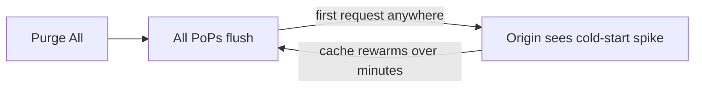

**Purge All** wipes every cached object on a distribution. The next request for any path is a cache miss that goes all the way to your origin.

## Use this when

- You can't predict which paths changed (mass content migration, root-level config swap).
- A security incident may have served compromised content from cache.
- You're decommissioning a distribution and want a clean slate before final teardown.

For everything else — deploys, single-asset hotfixes, API response invalidation — use [Purge by Pattern](/docs/cdn/purge/purge-by-pattern).

## Cost of a Purge All



Every active path becomes a cache miss simultaneously. Your origin will see a traffic spike — capacity-plan before pulling this trigger.

<Warning>
    Purge All is **global, instant, and irreversible**. It will impact P95 latency and origin load until the cache rewarms. Schedule it during low traffic and warn downstream teams.
</Warning>

## Console flow

<Frame caption="Purge All">
    
</Frame>

1. Open the distribution → **Purge** tab.
2. Pick **Purge All**.
3. Click **Purge**.

<Frame caption="Execute Purge All">
    
</Frame>

Propagates within seconds.

## Purge via API

```bash
curl -X POST "https://api.tenbyte.io/cdn/distributions/$DISTRIBUTION_ID/purge/all" \
  -H "Authorization: Bearer $TENBYTE_API_TOKEN"
```

Response:

```json
{
  "purge_id": "prg_01HXYZ...",
  "status": "queued",
  "scope": "all"
}
```

Poll status:

```bash
curl -sS "https://api.tenbyte.io/cdn/distributions/$DISTRIBUTION_ID/purge/$PURGE_ID" \
  -H "Authorization: Bearer $TENBYTE_API_TOKEN" | jq '.status'
```

See the [CDN API reference](/api-reference/cdn) for canonical fields.

## Pre-flight checklist

- [ ] Origin can absorb a cold-start traffic spike (autoscale ready or capacity proven).
- [ ] No live deploy in progress.
- [ ] Stakeholders notified (#oncall, #web-platform).
- [ ] Confirmed pattern purge cannot solve the problem.
- [ ] Have a rollback plan if origin fails to handle the spike.

## Verify

```bash
# Before — typical HIT ratio
curl -sSI "$CDN_HOST/" | grep -i x-cache
# x-cache: HIT

# Trigger purge, then any path
curl -sSI "$CDN_HOST/" | grep -i x-cache
# x-cache: MISS

# Watch [cache hit ratio] dashboard recover over the next few minutes.
```

## Recovery

- Watch [Cache hit ratio](/docs/cdn/analytics/cache-hit-ratio) — it nosedives immediately, recovers as paths warm.
- Watch origin error rate. If origin starts to fail, throttle traffic at your edge or scale up.
- Don't trigger another purge while recovery is in flight.

## Alternatives

| Need | Use |
|------|-----|
| Invalidate a specific path | [Purge by Pattern](/docs/cdn/purge/purge-by-pattern) — `/index.html` |
| Invalidate a folder | [Purge by Pattern](/docs/cdn/purge/purge-by-pattern) — `/static/*` |
| Roll back a deploy | Revert origin and run a targeted purge |
| Lower TTL going forward | Edit the [cache rule](/docs/cdn/distributions/cache-rules) |
