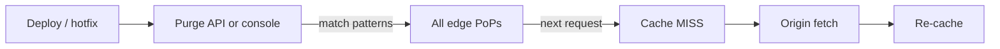

Purge by Pattern invalidates a precise set of cached objects without dumping the whole cache. This is the right tool for deploys, content fixes, and incident response.

## When to use this

- After a deploy that changes specific paths (`/static/main.js`, `/api/v1/*`).
- After fixing a content bug that's already cached.
- When TTL is too long for the asset you just updated.

For wholesale invalidation, use [Purge All](/docs/cdn/purge/purge-all) — but pattern purges are almost always preferable.

## How patterns work



The first request after a purge is a `MISS`. Plan your purge timing so the resulting origin spike is acceptable.

## Pattern rules

- Must start with `/`.
- `*` is a wildcard matching one or more characters.
- Up to **10 patterns** per purge request.

| Pattern | Matches |
|---------|---------|
| `/index.html` | Single object. |
| `/images/*` | Everything under `/images/`. |
| `/static/css/*` | All CSS files. |
| `/api/v1/*` | All v1 API responses. |
| `/photos/hero.*` | All formats / sizes of `hero` (after image optimizer). |

<Warning>
    `*` matches eagerly. `/api/*` purges every API response on the distribution. Scope tightly when you can.
</Warning>

## Console flow

<Frame caption="Purge by Pattern">
    
</Frame>

1. Enter one pattern per line in the input box.
2. Click **Purge** to dispatch.

<Frame caption="Execute Purge">
    
</Frame>

Purge propagates globally within a few seconds.

## Purge via API

```bash
curl -X POST "https://api.tenbyte.io/cdn/distributions/$DISTRIBUTION_ID/purge" \
  -H "Authorization: Bearer $TENBYTE_API_TOKEN" \
  -H "Content-Type: application/json" \
  -d '{
    "paths": [
      "/index.html",
      "/static/main.*",
      "/api/v1/products"
    ]
  }'
```

Response:

```json
{
  "purge_id": "prg_01HXYZ...",
  "status": "queued",
  "paths": ["/index.html", "/static/main.*", "/api/v1/products"]
}
```

Poll the purge job:

```bash
curl -sS "https://api.tenbyte.io/cdn/distributions/$DISTRIBUTION_ID/purge/$PURGE_ID" \
  -H "Authorization: Bearer $TENBYTE_API_TOKEN" | jq '.status'
# "queued" → "in_progress" → "completed"
```

See the [CDN API reference](/api-reference/cdn) for canonical fields.

## CI/CD integration

### GitHub Actions

```yaml
- name: Purge CDN after deploy
  run: |
    curl -fsS -X POST "https://api.tenbyte.io/cdn/distributions/${{ secrets.CDN_DISTRIBUTION_ID }}/purge" \
      -H "Authorization: Bearer ${{ secrets.TENBYTE_API_TOKEN }}" \
      -H "Content-Type: application/json" \
      -d '{"paths": ["/index.html", "/static/*"]}'
```

### Shell helper

```bash
#!/usr/bin/env bash
set -euo pipefail

: "${TENBYTE_API_TOKEN:?}"
: "${DISTRIBUTION_ID:?}"

paths_json=$(printf '%s\n' "$@" | jq -R . | jq -s '{paths: .}')

curl -fsS -X POST "https://api.tenbyte.io/cdn/distributions/$DISTRIBUTION_ID/purge" \
  -H "Authorization: Bearer $TENBYTE_API_TOKEN" \
  -H "Content-Type: application/json" \
  -d "$paths_json"
```

```bash
./purge.sh /index.html "/static/*"
```

## Verify the purge

```bash
# Before purge — likely HIT
curl -sSI "$CDN_HOST/index.html" | grep -i x-cache
# x-cache: HIT

# Trigger purge, then check again
curl -sSI "$CDN_HOST/index.html" | grep -i x-cache
# x-cache: MISS    (origin fetched fresh)

# Subsequent request
curl -sSI "$CDN_HOST/index.html" | grep -i x-cache
# x-cache: HIT
```

## Operational tips

- **Purge **before** flipping traffic.** For blue/green deploys, purge the green hostname after the new build is live, not before.
- **Use exact paths over wildcards.** `/static/main.abc123.js` invalidates one object; `/static/*` invalidates everything and risks an origin spike.
- **Avoid frequent global purges.** Each purge is a coordinated edge-wide operation. Hashed asset URLs make most purges unnecessary.
- **Monitor origin after a wide purge.** Watch [Cache hit ratio](/docs/cdn/analytics/cache-hit-ratio) — it dips immediately, then recovers as the cache rewarms.

## Limits and quotas

- Up to **10 patterns** per request.
- Purges are async; `completed` status typically lands within seconds, sometimes up to a minute under heavy load.
- Bulk purges (>1000/day) should batch and back off on `429`.

## Troubleshooting

| Symptom | Fix |
|---------|-----|
| Pattern rejected — must start with `/` | Add the leading slash. |
| `x-cache: HIT` immediately after purge | Edge briefly returned a stale node. Try one more request — global propagation isn't instant. |
| Wildcards seem to ignore deeper paths | `*` doesn't cross domains; double-check the pattern starts where you expect. |
| Origin spike after purge | Wildcard too broad. Combine with rate limits at the origin or refine the pattern. |
