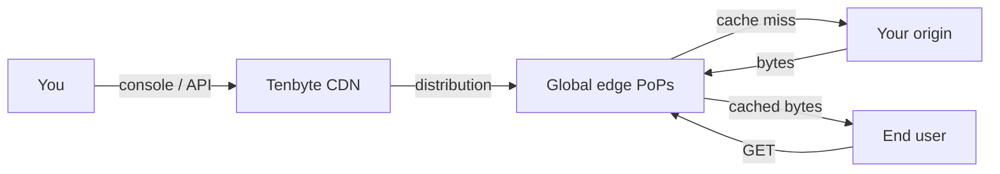

Get a Tenbyte CDN distribution serving traffic in under 10 minutes. This guide covers the console flow plus the curl checks and API calls that let you automate the rest.

## Prerequisites

- A **Tenbyte account** — [Sign up](https://beta.tenbyte.io/vidinfra)
- An **origin URL** that responds to HTTPS (your website, S3 bucket, or custom server)
- An **API token** if you plan to script things — generate one in **Organization → API Keys**
- `curl` (bundled with macOS / Linux / WSL)

## Architecture at a glance



## 1. Open the CDN workspace

Sign in, then pick **CDN** from the left sidebar.

<Frame caption="Tenbyte Dashboard">
    
</Frame>

<Frame caption="Select CDN from Dashboard">
    
</Frame>

The CDN workspace lists your distributions.

<Frame caption="Manage your Distribution">
    
</Frame>

## 2. Create a distribution

Walk through [Create distribution](/docs/cdn/distributions/create-distribution) to point at your origin. Once active, the console shows a distribution hostname like `your-distribution.tenbytecdn.com`.

Save it to your shell so the snippets below work as-is:

```bash
export CDN_HOST="https://your-distribution.tenbytecdn.com"
export CDN_PATH="/index.html"
```

## 3. Verify the edge with curl

First request — expect `MISS` (origin fetch):

```bash
curl -sSI "$CDN_HOST$CDN_PATH" | grep -iE 'http/|x-cache|cache-control|server'
```

Second request — expect `HIT` (served from cache):

```bash
curl -sSI "$CDN_HOST$CDN_PATH" | grep -iE 'http/|x-cache'
# HTTP/2 200
# x-cache: HIT
```

If you see `MISS` repeatedly, jump to [Cache rules](/docs/cdn/distributions/cache-rules) — the origin is probably sending `Cache-Control: no-store` or `private`.

## 4. Add cache, header, and access rules

| Goal | Where |
|------|-------|
| Override TTLs per path | [Cache rules](/docs/cdn/distributions/cache-rules) |
| Add CORS / security headers | [Headers](/docs/cdn/distributions/headers) |
| Geo-block, IP-allow, or referrer-lock | [Access rules](/docs/cdn/distributions/access-rules/overview) |
| Sign URLs for paid / private content | [Token authentication](/docs/cdn/distributions/access-rules/token-authentication) |
| Issue an SSL cert | [SSL](/docs/cdn/distributions/ssl) |

## 5. Automate via the API

All console operations also live in the [CDN API](/api-reference/cdn). Drop these into CI/CD or a deploy script.

```bash
export TENBYTE_API_TOKEN="..."   # from Organization → API Keys
export DISTRIBUTION_ID="..."     # from the distribution detail page
```

Purge a path after a deploy:

```bash
curl -X POST "https://api.tenbyte.io/cdn/distributions/$DISTRIBUTION_ID/purge" \
  -H "Authorization: Bearer $TENBYTE_API_TOKEN" \
  -H "Content-Type: application/json" \
  -d '{"paths": ["/index.html", "/static/*"]}'
```

Inspect the distribution config:

```bash
curl -sS "https://api.tenbyte.io/cdn/distributions/$DISTRIBUTION_ID" \
  -H "Authorization: Bearer $TENBYTE_API_TOKEN" | jq
```

<Note>
    Endpoint paths shown here mirror the [CDN API reference](/api-reference/cdn). Always check the reference for the exact shape — it is the source of truth.
</Note>

## What "done" looks like

- [ ] `curl -I` returns `HTTP/2 200` from the distribution hostname.
- [ ] Repeat requests show `x-cache: HIT`.
- [ ] DNS for your custom domain (if any) points at the distribution CNAME.
- [ ] SSL certificate is **Active** in the console.
- [ ] You can purge a path via the API and watch the next request return `MISS`.

## Next steps

- [Cache rules](/docs/cdn/distributions/cache-rules) — fine-tune TTLs and query-string handling.
- [Token authentication](/docs/cdn/distributions/access-rules/token-authentication) — sign URLs for protected media.
- [Image optimization](/docs/cdn/distributions/image-optimizer) — resize, convert, and compress on the fly.
- [Analytics](/docs/cdn/analytics/overview) — bandwidth, cache-hit ratio, response classes.
- [FAQs](/docs/cdn/cdn-faqs) — quick answers for ops and billing questions.
